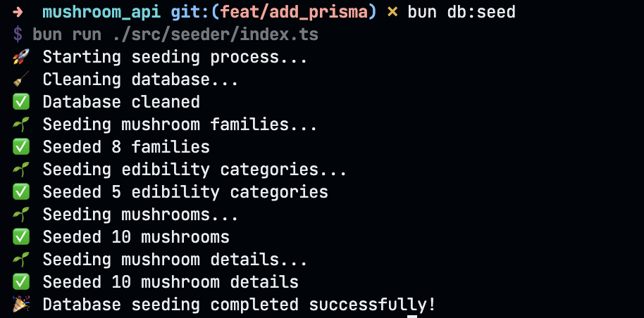

# Restful API Mushrooms 🍄


This is a RESTful API for mushroom information using Hono and Bun.

## Setup

To install dependencies:

```bash
bun install
```

## Running the project

To run the development server:

```bash
bun run dev
```
This will start the server at [http://localhost:3000](http://localhost:3000)

## Running seeder



## API Endpoints

**1. Edibility Categories**

| HTTP Method | Endpoint                        | Description                              |
| ----------- | ------------------------------- | ---------------------------------------- |
| GET         | `/api/edibility-categories`     | Get a list of all edibility categories.  |
| GET         | `/api/edibility-categories/:id` | Get a specific edibility category by ID. |
| POST        | `/api/edibility-categories`     | Create a new edibility category.         |
| PUT         | `/api/edibility-categories/:id` | Update an existing edibility category.   |
| DELETE      | `/api/edibility-categories/:id` | Delete an existing edibility category.   |

**2. Mushrooms**

| HTTP Method | Endpoint                             | Description                                  |
| ----------- | ------------------------------------ | -------------------------------------------- |
| GET         | `/api/mushrooms`                     | Get a list of all mushrooms.                 |
| GET         | `/api/mushrooms/:id`                 | Get a specific mushroom by ID.               |
| GET         | `/api/mushrooms/by-family/:familyId` | Get a list of mushrooms by family ID.        |
| GET         | `/api/mushrooms/edible/:isEdible`    | Get a list of mushrooms by edibility status. |
| POST        | `/api/mushrooms`                     | Create a new mushroom.                       |
| PUT         | `/api/mushrooms/:id`                 | Update an existing mushroom.                 |
| DELETE      | `/api/mushrooms/:id`                 | Delete an existing mushroom.                 |

**3. Mushroom Families**

| HTTP Method | Endpoint                     | Description                           |
| ----------- | ---------------------------- | ------------------------------------- |
| GET         | `/api/mushroom-families`     | Get a list of all mushroom families.  |
| GET         | `/api/mushroom-families/:id` | Get a specific mushroom family by ID. |
| POST        | `/api/mushroom-families`     | Create a new mushroom family.         |
| PUT         | `/api/mushroom-families/:id` | Update an existing mushroom family.   |
| DELETE      | `/api/mushroom-families/:id` | Delete an existing mushroom family.   |

<br>

## Docker

To build and run the Docker container:

```bash
docker build -t mushroom-api .
docker run -p 3000:3000 mushroom-api
```

## Contributing

Contributions are welcome! Please feel free to submit a Pull Request.

## License

[MIT](https://choosealicense.com/licenses/mit/)